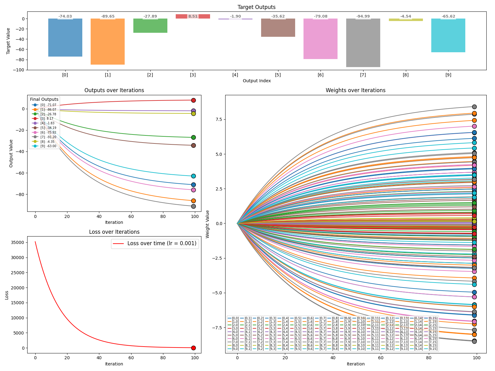
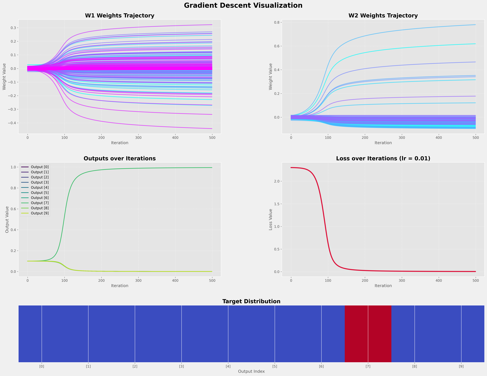
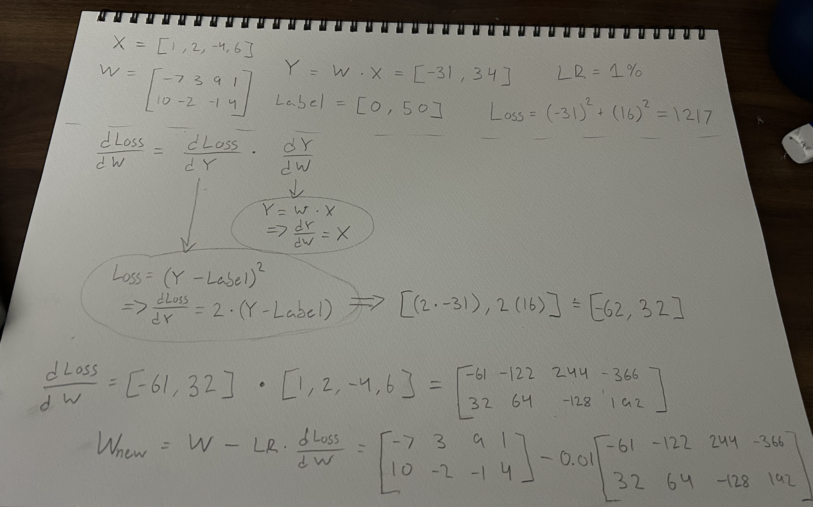

This program (SimpleGradient) initializes a random input vector (default size 16) and a weight matrix that is filled 
with 0s and is initialized to have dimensions Y.size rows by X.size columns. 

While the inputs and outputs do not represent any meaningful encoding, this program
illustrates the process by which a loss function is calculated, gradients are computed, 
and weights are tweaked to iteratively minimize loss. 

While a microcosm for the massive intertwined neural networks that operate within modern LLMs, 
it shows the intuition behind the algorithm (backpropagation/gradient descent) that allows us to
build networks that learn from data. 

\
\
\
\

This program (BetterGradient) takes things several steps further by using activation functions,
a second layer of weights, and a proper one-hot encoding for the target output. While I am 
still choosing to A) use one training example and B) not even assign this classifier to any
real world issue, I am emphasizing more so the calculus and beautiful application of the chain rule
to dynamically update the weights of a Neural Network, that it may learn from its input and target.

The plotting for this program is being improved. It is a more complex system than the first, 
so I have been working out the kinks in the graphing to best highlight what I feel are the most
important factors. 

\
\
\
\
\
The file SoftMaxDerivative.py does some exploration into the SoftMax function
used in BetterGradient.py (and many other NNs!) and its odd derivative that vanishes
when taking the partial derivative of the loss function with respect to the computed output of the NN
when using Cross Entropy Loss as the loss fn. Have fun!

\
\
\
\
\
\
\

Finally, below, I have attached two pictures of some of the notes I have been taking in my 
re-education in the calculus behind backpropagation. In no way is this stuff official or 
particularly novel in its presentation, but I thought why not share my notes....

